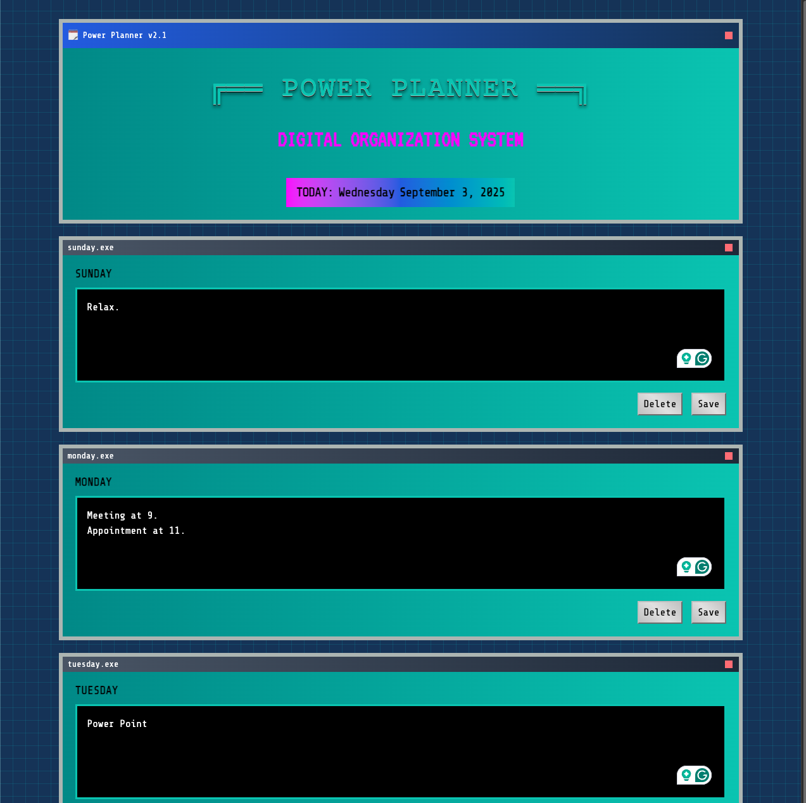

# Power Planner

[🚀 https://power-planner.pages.dev/](https://power-planner.pages.dev/)

---

## Table of Contents

- [Power Planner](#power-planner)
  - [Table of Contents](#table-of-contents)
  - [Description](#description)
  - [Technologies](#technologies)
  - [Screenshot](#screenshot)
  - [Installation](#installation)
  - [Usage](#usage)
  - [Contributing](#contributing)
  - [License](#license)

---

## Description

Power Planner is a simple planner web application designed to help you organize your week effortlessly. It presents each day with dedicated text fields, allowing you to add simple notes, tasks, or reminders. A key feature of this planner is its automatic reset functionality, which clears all notes every Monday, preparing a fresh slate for your new week.

## Technologies

This project leverages a modern front-end stack to deliver a responsive and interactive user experience:

*   **Alpine.js**: A rugged, minimal JavaScript framework for composing behavior directly in your markup.
*   **TypeScript**: A superset of JavaScript that adds static types, enhancing code quality and maintainability.
*   **TailwindCSS**: A utility-first CSS framework for rapidly building custom designs.
*   **HTML**: The standard markup language for creating web pages.
*   **CSS3**

## Screenshot

Take a look at the application in action:



## Installation

To get a local copy of this project up and running, follow these simple steps:

1.  **Clone the repository:**
    ```bash
    git clone https://github.com/leon-luna-ray/power-planner.git
    ```
2.  **Navigate to the project directory:**
    ```bash
    cd power-planner
    ```
3.  **Open `index.html` in your browser:**
    Since this is a client-side application, you can simply open the `index.html` file directly from your file system in any modern web browser.

No complex build steps or server setup are required!

## Usage

Using the Weekly Planner is straightforward:

1.  **Add Notes:** Click on any text field corresponding to a day of the week and start typing your notes, tasks, or appointments.
2.  **Save:** Your entries are typically saved automatically (e.g., to local storage) as you type or lose focus on a field.
3.  **Automatic Reset:** All entries will be automatically cleared every Monday morning, providing a fresh planner for the new week.

## Contributing

Contributions are what make the open-source community such an amazing place to learn, inspire, and create.

If you have a suggestion that would make this better, please fork the repo and create a pull request. You can also simply open an issue with the tag "enhancement".

1.  Fork the Project
2.  Create your Feature Branch (`git checkout -b feature/AmazingFeature`)
3.  Commit your Changes (`git commit -m 'Add some AmazingFeature'`)
4.  Push to the Branch (`git push origin feature/AmazingFeature`)
5.  Open a Pull Request

## License

This project is licensed under the MIT License. See the `LICENSE` file (if present, otherwise assume standard MIT) for more details.

---

Made with ❤️ by [rayluna.dev](https://www.rayluna.dev)